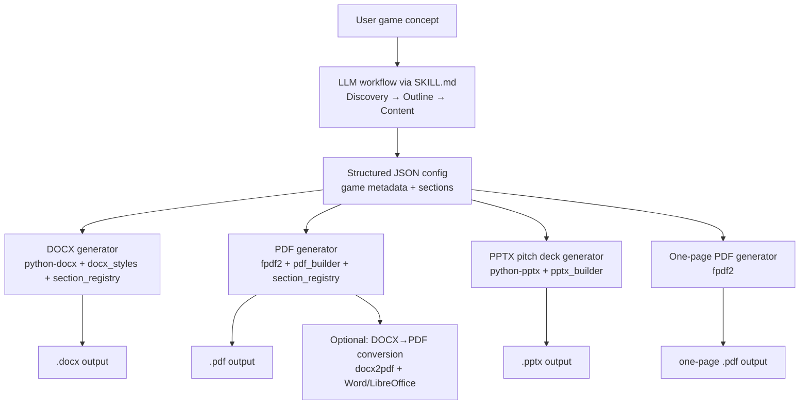

# Security, Trustworthiness, Performance, and Utility Review of ityes22/game-design-document

## Executive summary

I reviewed the repository’s prompts/templates and its Python export scripts for generating publisher-style Game Design Documents (GDDs) and companion pitch artifacts (DOCX, PDF, PPTX, and a one-page PDF). The repo positions itself as an “Anthropic Agent Skill” that runs a structured interview, produces a 19-section outline, generates section content, then exports formatted documents using Python scripts. citeturn4view0turn5view0turn39view0

From a security perspective, the code has a relatively small direct attack surface because the generators are local CLI tools that do not implement networking, authentication, or server endpoints. citeturn11view0turn36view0turn38view1 The primary security risks are supply-chain and operational: a missing security policy, no visible automated security checks, an installation manifest that is not compliant with pip’s documented requirements-file format, and an optional DOCX→PDF conversion path that delegates document parsing to external desktop software (Word/LibreOffice), which increases risk if untrusted documents are processed. citeturn24view0turn6view0turn35view0turn36view0turn37search3turn37search4

Trustworthiness is constrained by minimal project history (two commits total, both by the same author account displayed as “Said O”), no issues/PR activity, and provenance cues that can be interpreted as “official” despite the repo living under a personal namespace. citeturn22view0turn24view0turn39view0 The licensing and metadata also create attribution ambiguity (e.g., “Copyright 2024 Anthropic” in the Apache-2.0 boilerplate and “creator” metadata string in the PDF generator). citeturn17view2turn26view3turn36view0

Performance is likely acceptable for typical use (generating dozens of pages of text), but the implementation is “string-driven” (line-by-line parsing) with approximate layout heuristics in PDF rendering and non-ideal Table of Contents behavior in PDF (TOC appended because page insertion isn’t supported in the chosen workflow). This creates more quality/performance risk for very large tables, heavily formatted markdown-like content, or strict pagination requirements. citeturn12view0turn27view1turn30view0turn29view0

Utility is strong for teams who want a structured GDD workflow and polished exports, but difficulty is moderate: users need Python installed, must generate/maintain a JSON config structure, and must understand the split between “LLM generates content” vs “scripts export documents.” citeturn4view0turn17view0turn5view0 The largest practical “data sensibility” risk is that the prompt/examples/default pitch-deck content embed numeric claims and market metrics that can read as factual but are not enforced to be sourced; this can lead to credible-looking but unsupported outputs. citeturn21view0turn30view4turn34search2

Highest-impact recommendations (priority order):

1) Fix `requirements.txt` to match pip’s requirements-file format (one requirement per line) and adopt repeatable installs (pinning and, if desired, hash-checking). citeturn6view0turn35view0turn33search0  
2) Align the stated Python version with actual syntax used (either require Python ≥3.9 or refactor type hints for 3.8 compatibility). citeturn5view0turn14view0turn31search3  
3) Add basic security governance (SECURITY.md) and automate dependency/SAST/secret scanning in CI. citeturn24view0turn31search13turn31search2turn32search0turn32search1turn32search2  
4) Implement “data sensibility” guardrails in the prompt and add lightweight validation that flags unsourced numeric claims/placeholders prior to export. citeturn5view0turn30view4turn34search2  

## Scope, sources, and assumptions

I based this assessment on primary repository artifacts: the root documentation (README, SKILL, CLAUDE), dependency manifest (`requirements.txt`), generator scripts and their utility modules, templates/examples/assets, plus repository metadata visible via commit history and the Security tab. citeturn4view0turn5view0turn17view0turn6view0turn39view0turn22view0turn24view0 External sources are used only where they directly support secure-development recommendations (pip requirements format and secure installs, dependency auditing and SAST/secret scanning tools, and LLM risk guidance). citeturn35view0turn33search0turn31search2turn32search0turn32search2turn34search2turn34search3

Assumptions (explicitly stated where repo details are unspecified):

- Deployment model is unspecified; I assume the scripts are typically run locally by a single user (not as a multi-tenant web service), because the repository only provides CLI scripts and local file output. citeturn17view0turn11view0turn36view0  
- Target OS/platform is unspecified; I assume cross-platform intent (Windows/macOS/Linux) because the instructions include generic Python venv usage and because the PDF conversion path references Word/LibreOffice on different OSes. citeturn17view0turn36view0  
- Python version constraints are ambiguous: SKILL metadata says Python ≥3.8, but code uses newer typing syntax; I treat this mismatch as a material risk until resolved. citeturn5view0turn14view0turn31search3  
- Threat model is unspecified; I assume inputs are “trusted” game concepts and configs authored by the user or their LLM workflow. Where the scripts accept arbitrary file paths (notably DOCX conversion), I explicitly discuss the higher-risk scenario where inputs could be attacker-controlled. citeturn36view0turn37search3turn37search4  

## Repository map and architecture

The initial release commit shows the repo is intentionally small and self-contained: 27 files added, including the prompt entry point (`SKILL.md`), documentation, four generator scripts, a `scripts/utils/` library, eight templates, three example outlines, and an asset spec. citeturn39view0turn26view1 The overall design is: “LLM-guided content generation” (via `SKILL.md`) produces a structured content payload (JSON), then the Python scripts render that payload into formatted deliverables. citeturn5view0turn17view0turn11view0turn36view0turn13view0



This flow is grounded in the repo’s own stated four-phase workflow and the CLI scripts’ supported inputs (`--title` or `--config`, plus DOCX conversion for the PDF script). citeturn4view0turn5view0turn36view0turn30view3turn13view0turn38view1

Key components table (purpose, risks, recommended actions):

| Component | Primary purpose | Potential risks | Recommended actions |
|---|---|---|---|
| `SKILL.md` | Defines the “skill” behavior and 4-phase interview→outline→content workflow | Data sensibility: encourages specific metrics without enforcing sources; risk of credible but unsupported outputs | Add explicit “source required” conventions for external claims; require marking assumptions; add “sensitive data” handling guidance |
| `requirements.txt` | Declares runtime deps | Format appears non-compliant with pip’s line-oriented requirements format; versions not pinned | Split into one requirement per line; add pinned versions (and optionally hashes) |
| `scripts/generate_gdd_docx.py` | Builds DOCX from JSON content; parses markdown-like structures | Robustness: “standalone mode” may still reference utils-only symbols; no formal schema validation step | Add JSON schema validation; fix fallback behavior when utils absent; add size limits |
| `scripts/generate_gdd_pdf.py` | Builds PDF directly with fpdf2 OR converts an existing DOCX to PDF | DOCX conversion increases attack surface if untrusted inputs are processed; PDF TOC behavior appended/approximate | Gate/disable DOCX conversion by default; document safe usage; prefer DOCX→PDF only for trusted files or sandboxed conversion |
| `scripts/generate_pitch_deck_pptx.py` | Generates pitch deck with defaults | Default content includes placeholder stats/claims that can be misread as factual | Make placeholders unmistakable; add “SOURCE NEEDED” flags; validate numeric claims |
| `scripts/utils/section_registry.py` | Canonical section registry + simple validation & genre-based omission | Python version mismatch via `dict[str, …]` typing; validation is keyword-based (false positives/negatives) | Add Python compatibility fix; strengthen validation to be schema-based and placeholder-aware |
| `templates/*` and `examples/*` | Provide canonical structures and examples | Examples include market sizes and KPI targets; can be copied as “facts” | Mark examples as fictional; add citations or “example-only” banners |
| Security governance (missing) | Vulnerability reporting, disclosures | No SECURITY.md; no visible advisories | Add SECURITY.md and basic reporting guidance; add CI checks |

The component list and file inventory are corroborated directly by the initial commit file tree and the README’s documented file structure. citeturn39view0turn4view0

## Security audit

Findings: repository security posture and code-level risks

The repo’s Security page explicitly reports “No security policy detected” (no `SECURITY.md`) and no published advisories. citeturn24view0turn31search13 This means there is no guidance for reporting vulnerabilities, no stated supported versions, and no established disclosure process—raising practical risk if others adopt the code or publish derived skills. citeturn24view0turn31search1

Dependency and supply-chain posture is the most immediate technical concern. The runtime dependency set is small (python-docx, fpdf2, python-pptx), but the `requirements.txt` file is a single line containing multiple specifiers separated by spaces. Pip documents requirements files as line-oriented, where each line indicates a single requirement or an install option, making the current file format unreliable and likely to fail for `pip install -r requirements.txt`. citeturn6view0turn35view0 Even if corrected, the repo uses only “minimum version” constraints, which increases exposure to supply chain and breaking changes over time; pip’s own documentation outlines mechanisms for repeatable installs and hash-checking mode to reduce tampering risk. citeturn6view0turn33search0turn35view0

The PDF generator includes an explicit mode to convert an existing DOCX to PDF using `docx2pdf`, which requires Word (Windows/Mac) or LibreOffice (Linux). citeturn36view0 If this conversion path is ever used in a service-like context (multi-user, untrusted uploads), processing untrusted document files is a known high-risk pattern; OWASP’s file upload guidance emphasizes that consequences depend heavily on what the application does with uploaded files, and LibreOffice itself documents security fixes for cases where specially crafted files can lead to code execution when opened. citeturn37search0turn37search3turn37search4

Secrets exposure risk appears low in the current snapshot (no obvious API keys in the reviewed files), and `.gitignore` excludes likely local/IDE artifacts (including `.claude/settings.json`, which is a sensible preventive step). citeturn17view1turn39view2 However, there is no evidence of automated secret scanning, which is typically recommended even for small projects because secrets can enter via copy/paste or example snippets. citeturn32search2turn32search3

Risk/benefit assessment

The main benefit is a constrained runtime and a local-first architecture: the scripts ingest local JSON and emit local documents, without networking, credential management, or server exposure. citeturn30view3turn36view0turn38view1 This meaningfully reduces the attack surface versus a hosted “GDD generator API.”

The main risks, in order of likely impact, are: (1) broken or misleading installation/dependency mechanisms, (2) lack of security governance and automated scanning, and (3) unsafe operational patterns if the DOCX conversion pathway is used with untrusted inputs. citeturn6view0turn24view0turn36view0turn37search3

Concrete remediation and improvements (code-level where applicable)

Fix `requirements.txt` format and harden dependency management. Pip expects requirements files to be line-based. Refactor to:

```text
python-docx>=1.1.0
fpdf2>=2.7.0
python-pptx>=0.6.23
```

Then, for stronger control, add pinning (e.g., `==`) and optionally hash-checking mode (with `--hash=...`) following pip’s secure installs guidance. citeturn35view0turn33search0

Add a SECURITY policy and minimally adopt secure repo hygiene. GitHub documents using `SECURITY.md` as a good practice for reporting and collaborating on vulnerability disclosure. citeturn31search13turn31search1 Given the GitHub Security tab already flags the absence, adding it is a low-effort, high-signal improvement. citeturn24view0

Automate SCA/SAST/secret scanning in CI (or at least document “how to audit” and provide a Makefile). Suggested baseline:

- Dependency vulnerability scanning via `pip-audit` (uses the Python Packaging Advisory Database). citeturn31search2  
- Python SAST via Bandit (AST-based checks for common issues). citeturn32search0  
- Rule-based SAST via Semgrep (`semgrep scan`). citeturn32search1  
- Secret scanning via Gitleaks or TruffleHog (TruffleHog emphasizes verification for classified secret types). citeturn32search2turn32search3  

Reduce risk of DOCX conversion misuse. If the repo is meant for local, trusted workflows, I recommend making the conversion mode “explicitly advanced” (documented as trusted-only) and/or gating it behind a flag like `--i-understand-docx-risk` (even a soft guard reduces accidental unsafe use). The current code path will invoke external converters directly without sandboxing. citeturn36view0turn37search3

Estimated effort and priority

- Requirements-file fix + add SECURITY.md: **Effort: low; Priority: high**. citeturn6view0turn24view0turn35view0  
- Add CI scans (pip-audit, Bandit, Semgrep, secret scanning): **Effort: medium; Priority: high**. citeturn31search2turn32search0turn32search1turn32search2  
- DOCX conversion risk gating: **Effort: low/medium; Priority: medium** (high if the project is deployed as a service). citeturn36view0turn37search3  

## Trustworthiness and efficiency

Findings: provenance, maintainability signals, and internal consistency

The commit history is extremely small: two commits are visible, both authored/committed by the same account displayed as “Said O,” with the most recent commit dated Feb 14, 2026. citeturn22view0turn25view0 The repository also shows no open issues and no pull requests in the interface, which is consistent with a new or minimally used project. citeturn22view0turn22view1turn22view2

There are multiple cues that can confuse users about “officialness” and attribution. The LICENSE file is Apache-2.0 but includes “Copyright 2024 Anthropic” in the boilerplate notice section, and the PDF generator sets a “creator” metadata string that includes “Anthropic.” citeturn17view2turn26view3turn36view0 The README and project instructions repeatedly call this an “Anthropic Agent Skill.” citeturn4view0turn17view0turn39view0 None of these are necessarily wrong, but together they create an avoidable trust ambiguity: users may infer official endorsement/support when the repository is in a personal namespace.

A key internal consistency issue is the stated Python version requirement vs the syntax used. `SKILL.md` metadata says “python>=3.8.” citeturn5view0 But `scripts/utils/section_registry.py` uses `dict[str, SectionDef]` typing without `from __future__ import annotations`, which relies on standard-collection generics introduced by PEP 585 (Python 3.9+). citeturn14view0turn31search3 Practically, that means the advertised “3.8+” claim is not trustworthy until fixed (either by raising the minimum to 3.9+ or refactoring typing). citeturn5view0turn14view0

Efficiency (engineering efficiency, not runtime) is generally good: the codebase is small and feature-oriented, with a centralized section registry and reusable builders for DOCX/PDF/PPTX. citeturn14view0turn15view0turn15view1turn16view0 The architecture is straightforward to maintain, but it is missing the typical reliability scaffolding (tests, linting, CI) that would demonstrate correctness and prevent regressions. citeturn24view0turn39view0

Risk/benefit assessment

Benefit: A small, explicit, mostly template-driven codebase is easier to audit than a large framework, and the section registry makes behavior predictable. citeturn14view0turn39view0

Risk: Trust signals are weakened by (a) attribution ambiguity and (b) contradictory Python requirements. Those are reputational and operational risks (install failures, user confusion) rather than “exploitable vulnerabilities,” but they materially affect whether I would treat the artifacts as trusted inputs in a professional workflow. citeturn5view0turn14view0turn17view2turn36view0

Concrete remediation and improvements (code-level where applicable)

Resolve the Python version mismatch (two viable options):

Option A (simplest): raise minimum supported Python to 3.9+ everywhere documentation claims “3.8+.” This aligns with PEP 585 typing usage. citeturn5view0turn31search3

Option B (retain 3.8+): change `dict[str, …]` to `Dict[str, …]` and/or add `from __future__ import annotations` at the top of files using PEP 585 generics. citeturn14view0turn31search3

Clarify provenance/attribution: add a short `NOTICE` (or README section) explicitly stating authorship and that this repository is not an official product unless that is intended. Also consider changing PDF metadata “creator” string to a neutral project name (e.g., “game-design-document generator”) to avoid misattribution in distributed PDFs. citeturn36view0turn4view0

Add minimal quality gates: even a thin CI that runs `python -m compileall`, basic linting, and unit tests for parsers (table/code-block parsing) would significantly increase trust in correctness for DOCX/PDF generation logic. citeturn12view0turn27view1turn15view1

Estimated effort and priority

- Python version alignment + requirements.txt correction: **Effort: low; Priority: high**. citeturn5view0turn14view0turn35view0  
- Provenance clarity + PDF metadata cleanup: **Effort: low; Priority: medium**. citeturn17view2turn36view0  
- CI + basic tests: **Effort: medium; Priority: medium/high** (high if others will rely on outputs for business decisions). citeturn39view0turn12view0  

## Performance considerations

Findings: likely runtime behavior and bottlenecks

The DOCX generator parses input content line-by-line, handling code fences, markdown-ish tables, headings, bullets, and custom markers like `[DIAGRAM:]` and `[OPEN QUESTION:]`. citeturn11view0turn12view0 This approach is generally O(n) in number of lines, but python-docx operations can become slow when adding many paragraphs/tables and styling runs repeatedly—especially for “40–80 page” documents as marketed. citeturn4view0turn12view0

The PDF generator uses a similar line-based parsing strategy and renders tables with equal-width columns computed from `PDFLayout.CONTENT_WIDTH / n_cols`. citeturn27view1turn28view3 This is simple, but wide or text-heavy columns can overflow cell widths and create pagination/layout artifacts. The callout box height estimation uses heuristics (estimated chars-per-line) rather than exact layout measurement, which can cause clipping or excessive whitespace depending on input length. citeturn29view0

TOC handling differs by output type: the DOCX generator inserts a Word TOC field that requires the user to update fields in Word, while the PDF generator explicitly notes TOC page numbers are approximate and ultimately appends a rendered TOC because fpdf2 cannot insert pages in-place. citeturn11view0turn30view0turn29view2 This is not a security issue, but it affects perceived “publisher-grade” polish and may create friction for users expecting a front-of-document TOC in PDF. citeturn30view0turn29view2

Risk/benefit assessment

Benefit: The dependency set is light and the algorithms are simple; for typical use (dozens of pages, modest tables), performance should be acceptable on modern hardware. citeturn11view0turn27view1

Risk: The “publisher-grade” goal may be limited by PDF layout heuristics and TOC placement, and performance could degrade for large tables, deeply nested content, or extremely long sections. citeturn27view1turn29view0turn30view0

Concrete remediation and improvements (code-level where applicable)

Introduce content-size safeguards and early warnings: before rendering, compute rough size indicators (word count, table count, max table width) and warn or suggest DOCX-first workflow if thresholds are exceeded. The repo already contains `validate_gdd_content` in the section registry, but the generators do not appear to invoke it prior to export; wiring it in would improve predictability. citeturn14view0turn12view0turn36view0

Improve PDF table rendering: add per-column width controls (either inferred from header lengths or user-specified in JSON) and implement multi-line cell wrapping where needed. The current equal-width strategy is simple but brittle for real-world spec tables. citeturn27view1turn28view3

Make PDF TOC behavior explicit in UX: since the script already notes the limitation, I would also (a) place the rendered TOC at the *end* with a clear “Appendix: TOC” heading, and (b) recommend DOCX→PDF conversion (trusted-only) when a front-of-document, accurate TOC is required. citeturn30view0turn36view0

Estimated effort and priority

- Add pre-export validation + size warnings: **Effort: low/medium; Priority: medium**. citeturn14view0turn12view0  
- Improve PDF table layout: **Effort: medium/high; Priority: medium**. citeturn27view1turn28view3  
- Clarify TOC UX and recommended workflow: **Effort: low; Priority: medium**. citeturn30view0turn29view2  

## Utility, difficulty, and data sensibility

Findings: user value, adoption friction, and “sensible data” risk

Utility is high for users who want structured GDDs: `SKILL.md` defines a strict four-phase conversational flow (discovery interview → outline → full content generation → document output) intended to reduce rework and produce actionable specs. citeturn5view0turn4view0turn17view0 The section registry and templates encode a fairly comprehensive “what belongs in a GDD” framework, including UX flow documentation, monetization strategy structure, and technical requirements placeholders. citeturn14view0turn19view1turn19view2turn19view3

Difficulty is moderate. The repo assumes users can: (a) run Python venv, (b) install dependencies, (c) produce a JSON config in the expected schema, and (d) execute the scripts correctly. citeturn17view0turn30view3turn36view0turn38view1 For nontechnical designers, this “two-system” workflow (LLM writes content; scripts build documents) may be a barrier unless wrapped in a simple UI or a one-command tool. citeturn4view0turn17view0

Data sensibility risk is the most serious practical risk for users, even if it is not a classic “security vulnerability.” The pitch deck generator ships with default blocks that include market-size stat placeholders and a retention target line containing an “industry avg” claim; these can be exported into a PPTX if the user doesn’t override them in config. citeturn30view4turn13view0 Example outlines also contain large, specific market and KPI claims (e.g., “$15B+ annually” and detailed retention targets), which—without explicit “fictional example” framing and sources—can be copied forward into real investor-facing documents. citeturn21view0turn20view0

Because the “skill” component relies on LLM generation, there is a known risk of hallucinated or fabricated content, especially when the prompt demands specificity and numeric detail. citeturn5view0turn34search2 If the workflow is used to generate business claims (market sizing, KPIs, revenue projections), those claims need sourcing or explicit labeling as assumptions to avoid producing polished but misleading artifacts. citeturn34search2turn19view2turn13view0

Risk/benefit assessment

Benefit: The repository is genuinely useful as a “structure + export” kit; it can standardize documentation quality and speed up production of consistent artifacts. citeturn4view0turn18view0turn39view0

Risk: Without “data provenance” guardrails, the same polish that adds value can amplify harm—users may treat generated numbers as researched facts, or present them externally without validation. This is a credibility and business-risk issue, and it’s specifically relevant because the repo explicitly targets publisher/investor outputs (DOCX/PDF/PPTX). citeturn4view0turn30view4turn34search2

Concrete remediation and improvements (prompt + light code)

Prompt-level guardrails (high leverage): define a policy in `SKILL.md` that any external market statistic, KPI benchmark, or revenue claim must be either:

- user-supplied (explicitly attributed: “Provided by user”), or  
- sourced (“Source: …”) with an explicit citation form, or  
- declared as an assumption (“Assumption: …; validate later”).  

This aligns with the repo’s existing practice of flagging open questions and playtest values (it already uses `[OPEN QUESTION:]` / `[PLAYTEST:]` conventions). citeturn5view0turn12view0

Code-level validation (lightweight, pragmatic): extend `validate_gdd_content` (or add a second validator) to flag numeric-looking tokens in “business sections” (Executive Summary, Monetization, Competitive Analysis) that are not accompanied by a “Source:” or “Assumption:” marker. The current validation is only keyword-based (“does the section contain words resembling key element names”), which won’t catch unsourced metrics. citeturn14view0turn30view4

Make placeholders unmistakable in outputs: update default pitch-deck and one-pager placeholders to include a hard prefix like `SOURCE NEEDED:` so exported slides cannot be mistaken for researched results. citeturn30view4turn38view0

Estimated effort and priority

- Prompt-level citation/assumption protocol: **Effort: low; Priority: high** (directly addresses “risks from false outputs”). citeturn5view0turn34search2  
- Add numeric “data sensibility” validator: **Effort: medium; Priority: high**. citeturn14view0turn30view4  
- Strengthen placeholders in default pitch content: **Effort: low; Priority: medium/high**. citeturn30view4turn13view0  

## Remediation roadmap and reproducible audit commands

Prioritized remediation roadmap (effort + priority)

Immediate fixes (high priority)

- Correct `requirements.txt` into pip-compliant, line-based entries; then decide whether to pin versions and/or adopt hash-checking mode for repeatable installs. **Effort: low; Priority: high**. citeturn6view0turn35view0turn33search0  
- Resolve Python 3.8 vs 3.9+ mismatch (update requirement or refactor typing). **Effort: low; Priority: high**. citeturn5view0turn14view0turn31search3  
- Add `SECURITY.md` and basic vulnerability reporting guidance, since GitHub currently flags its absence. **Effort: low; Priority: high**. citeturn24view0turn31search13  

Near-term hardening (medium priority)

- Add CI checks: dependency audit (`pip-audit`), Python SAST (Bandit), general SAST rules (Semgrep), secrets scanning (Gitleaks/TruffleHog). **Effort: medium; Priority: high** for any repo distributed to others. citeturn31search2turn32search0turn32search1turn32search2turn32search3  
- Add “data sensibility” guardrails in `SKILL.md` + validation checks to prevent unsourced numeric claims from silently passing into exported documents. **Effort: low/medium; Priority: high**. citeturn5view0turn30view4turn34search2  

Reproducible commands (audits, linters, secret scanners)

```bash
# Clone
git clone https://github.com/ityes22/game-design-document.git
cd game-design-document

# Create and activate a virtual environment
python3 -m venv .venv
source .venv/bin/activate

# Install runtime deps (after requirements.txt is fixed to be pip-compliant)
pip install -r requirements.txt

# Install audit / analysis tooling (local-only workflow)
pip install pip-audit bandit semgrep

# Dependency vulnerability scan (SCA)
pip-audit -r requirements.txt

# Python security linter (SAST)
bandit -r scripts -x .venv -f json -o bandit.json

# Semgrep scan (default ruleset example)
semgrep scan --config "p/default" .
```

These tools and commands align with their maintained documentation: pip-audit (Python dependency vulnerability scanning), Bandit (Python AST security checks), and Semgrep’s CLI scanning model. citeturn31search2turn32search0turn32search1

```bash
# Secret scanning options (choose one)
# Gitleaks (repo + history scanning)
gitleaks detect --source . -v --report-format json --report-path gitleaks.json

# TruffleHog (git scanning; can verify some secrets)
trufflehog git file://$(pwd)
```

Gitleaks and TruffleHog are both explicitly designed to detect secrets in repositories, with TruffleHog emphasizing classification and verification capabilities for supported secret types. citeturn32search2turn32search3

```bash
# Generate artifacts (template-only quick runs)
python scripts/generate_gdd_docx.py --title "My Game" --output "output/MyGame_GDD.docx"
python scripts/generate_gdd_pdf.py  --title "My Game" --output "output/MyGame_GDD.pdf"
python scripts/generate_pitch_deck_pptx.py --title "My Game" --output "output/MyGame_Pitch.pptx"
python scripts/generate_one_pager_pdf.py --title "My Game" --output "output/MyGame_OnePager.pdf"
```

These CLI entry points and options are documented in the repo and implemented by the scripts. citeturn4view0turn30view3turn36view0turn13view0turn38view1